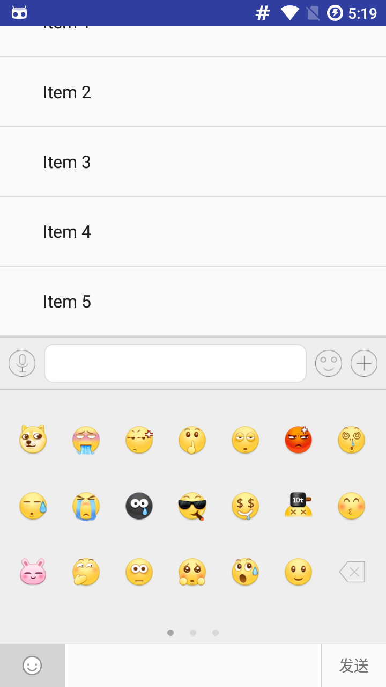

## FastBee
## 主要目的

- 与第三方库分离,可以自由定制的开发框架
- MVP实践
- 一个能够快速集成的框架.
- 总结一年来学习,开发的感悟.
- App开发中应该注意到的一些问题.

## 介绍
### 使用到的开源库

- Okhttp,Retrofit,Gson.
- ButterKnife.
- RxJava,RxAndroid,Rclifecycle.
- Sqlcipher
- PermissionsDispatcher
- Leakcanary
- and_swipeback
- ultra-ptr
- CircleRefreshAndLoadMoreLayout

### 借鉴改善后的开源库

- okhttp-utils
- luban
- emotionkeyboard
- AndroidUtilCode
- 等等一些现在暂时无法找到原始地址的库

### 项目结构

- App(Demo)
- easylinkingadapter(用于简化Listview多Type情景下的Adapter)
- easylinkingimageloader(一个图片加载管理器,为了能够随时随地替换图片框架)
- easylinkingkeyboard(优化过后的键盘控件)
- easylinkingnet(网络框架,稍微改造了一下,后期会全部剔除)
- easylinkingutils(在原来的基础上增加了修改了一些工具类)
- easylinkingview(自定义View)

### 截图
 

<a href="screen/3.png">

## License
Copyright 2016 Blankj

Licensed under the Apache License, Version 2.0 (the "License");
you may not use this file except in compliance with the License.
You may obtain a copy of the License at

    http://www.apache.org/licenses/LICENSE-2.0

Unless required by applicable law or agreed to in writing, software
distributed under the License is distributed on an "AS IS" BASIS,
WITHOUT WARRANTIES OR CONDITIONS OF ANY KIND, either express or implied.
See the License for the specific language governing permissions and
limitations under the License.